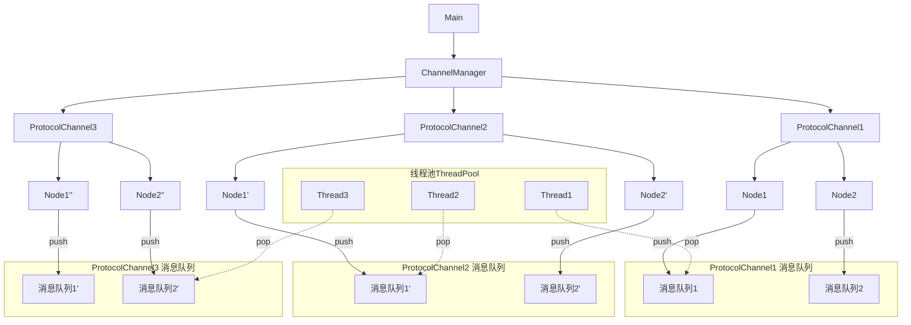

Makefile语法笔记
=====================

变量
-------------------
$@：目标文件，$^：所有的依赖文件，$<：第一个依赖文件,$?：所有更新过的依赖文件

通配符 (Wildcards)
-------------------
*：匹配任意数量字符（不含路径分隔符）

?：匹配单个字符

[...]：匹配字符集（如 [abc] 匹配 a/b/c）

[^...]：排除字符集

工具链
-------------------
### arm32    -> `arm-linux-gnueabihf-g++`
### arm64    -> `aarch64-linux-gnu-g++`
### x86_win  -> `x86_64-w64-mingw32-g++`

-----
## 主程序流程图

